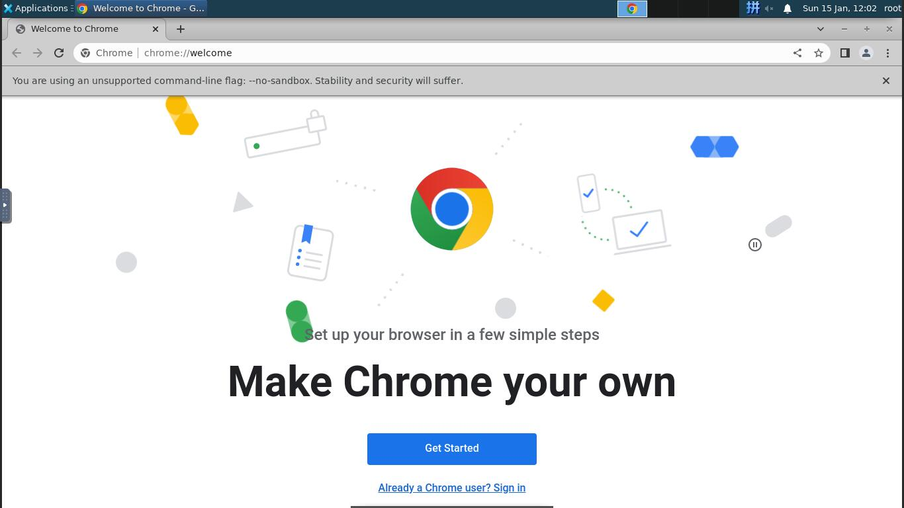
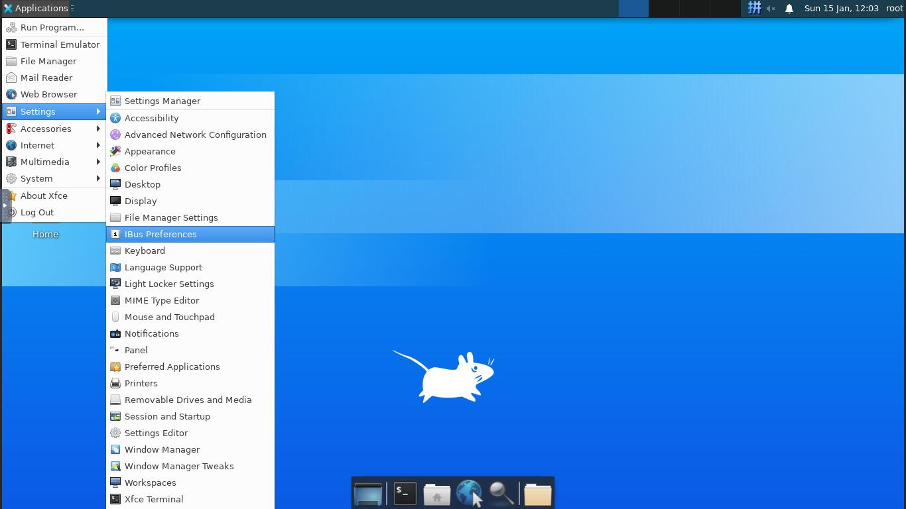
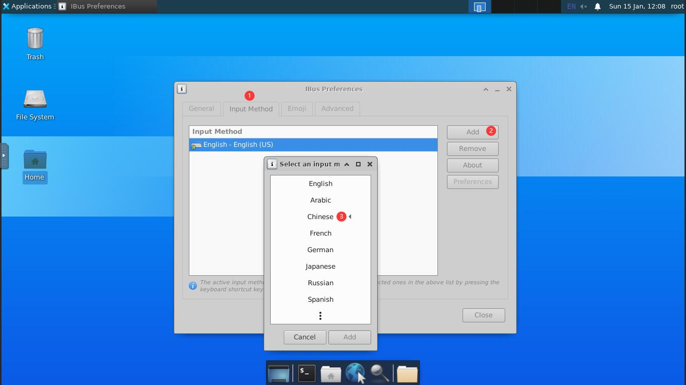
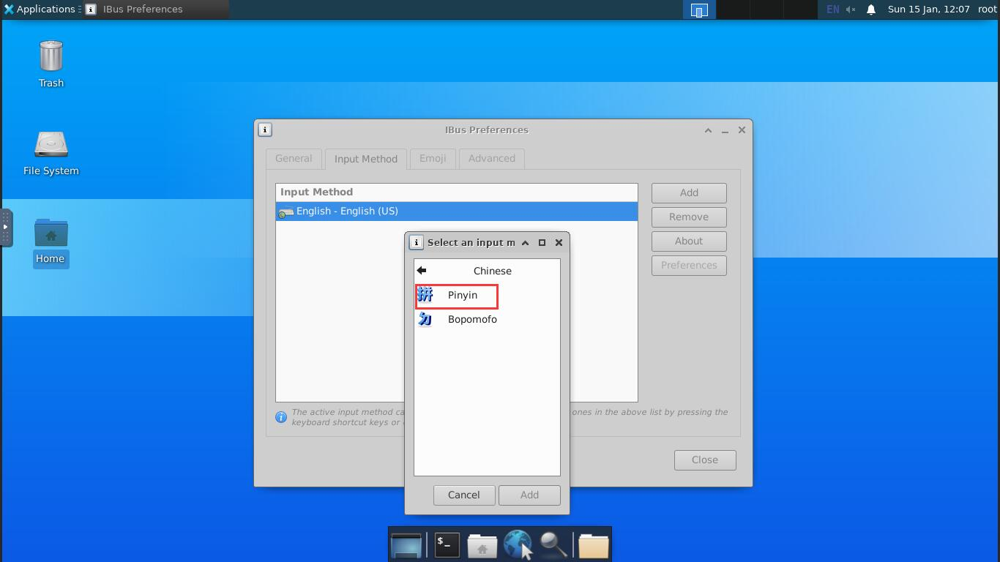

# docker-ubuntu-desktop

docker-ubuntu-desktop 是一个 Docker 镜像，提供 Web VNC 接口来访问 Ubuntu Xfce4 桌面环境。




## 特性

- Ubuntu 20.04
- 桌面环境 [**Xfce4**](http://www.xfce.org)
- VNC服务 (默认 VNC 端口 `5901`)
- [**noVNC**](https://github.com/novnc/noVNC) - HTML5 VNC 客户端 (默认 http 端口 `6901`)
- 谷歌浏览器
- 拼音输入法

## 用法

- 打印帮助页:

```
docker run imgyh/docker-ubuntu-desktop --help
```

- 运行映射到本地端口 `5901`（vnc 协议）和 `6901`（vnc web 访问）的命令：

```
docker run -d -p 5901:5901 -p 6901:6901 imgyh/docker-ubuntu-desktop
```

- 进入容器使用交互模式 `-it` 和 `bash`

```
docker run -it -p 5901:5901 -p 6901:6901 imgyh/docker-ubuntu-desktop bash
```

## 连接与控制

如果容器像上面提到的那样启动，请通过以下选项之一进行连接：

- 通过 VNC 查看器 `localhost:5901` 连接，默认密码：`vncpassword`
- 通过 noVNC HTML5 完整客户端连接：[`http://localhost:6901`](http://localhost:6901)，默认密码：`vncpassword`
- 通过noVNC HTML5 lite 客户端连接：[`http://localhost:6901/vnc_lite.html?password=vncpassword`](http://localhost:6901/vnc_lite.html?password=vncpassword)

## 环境变量设置

可以在 `docker run` 阶段覆盖以下 VNC 环境变量以自定义容器内的桌面环境：

- `VNC_COL_DEPTH`， 默认：`24`
- `VNC_RESOLUTION`，默认：`1280x1024`
- `VNC_PW`，默认：`vncpassword`
- `VNC_PASSWORDLESS`，默认：`false`

### 重写VNC密码

覆盖环境变量的值 `VNC_PW`

```
docker run -it -p 5901:5901 -p 6901:6901 -e VNC_PW=my-pw imgyh/docker-ubuntu-desktop
```

### 重写 VNC 分辨率

覆盖环境变量的值 `VNC_RESOLUTION`

```
docker run -it -p 5901:5901 -p 6901:6901 -e VNC_RESOLUTION=800x600 imgyh/docker-ubuntu-desktop
```

### 无密码启动

设置 `VNC_PASSWORDLESS` 为 `true` 禁用 VNC 密码

```
docker run -it -p 5901:5901 -p 6901:6901 -e VNC_PASSWORDLESS=true imgyh/docker-ubuntu-desktop
```

### 仅查看 VNC

设置环境变量 `VNC_VIEW_ONLY=true`。如果设置，启动脚本将为控制连接创建一个随机密码保存在 `VNC_PW`环境变量中。可以连接到容器查看密码。
```
docker run -it -p 5901:5901 -p 6901:6901 -e VNC_VIEW_ONLY=true imgyh/docker-ubuntu-desktop
```

## 拼音输入法设置

找到Settings->iBus Preference->Input Method->Add->Chinese







## 参考

[docker-ubuntu-desktop](https://github.com/gotoeasy/docker-ubuntu-desktop)

[docker-ubuntu-vnc-desktop](https://github.com/fcwu/docker-ubuntu-vnc-desktop)

[docker-headless-vnc-container](https://github.com/ConSol/docker-headless-vnc-container)

## 更新日志

更新日志在此处查看：[**changelog.md**](./changelog.md)